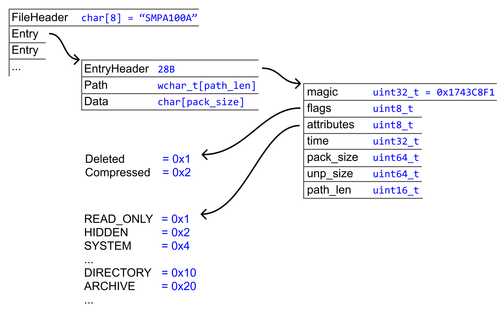

# Total Commander Plugin Tutorial

This repository contains sample code accompanying a tutorial about writing a Packer Plugin (WCX) for [Total Commander](https://www.ghisler.com/) file manager app.

It also defines a simple, custom archive format that uses [zlib](https://zlib.net) library for data compression.

The tutorial itself will be available online in 2026.

Author: Adam Sawicki, https://asawicki.info

License of the code: MIT

Written for Windows in C++ using Visual Studio 2022.

External libraries used:

- [zlib](https://zlib.net) - data compression library
    - Bundled in `third_party\zlib-1.3.1`
- [str_view](https://github.com/sawickiap/str_view) - null-termination-aware string-view class for C++
    - Bundled in `third_party\str_view.hpp`

## File format

